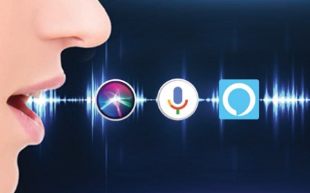

# Motivation

I have been working on independent projects for a long time now and have worked on projects that involve API integration, web scrapping, utilizing libraries etc. I was thinking of utilising my skills to develop a chatbot for  myself. But I realised that making a personal voice assistant would be even more fun. 
I came across speech recognition library and thought of giving it a try.

# What is a Voice Assistant?

A voice assistant or intelligent personal assistant is a software agent that can perform tasks or services for an individual based on verbal commands i.e. by interpreting human speech and respond via synthesized voices. Users can ask their assistants’ questions, control home automation devices, and media playback via voice, and manage other basic tasks such as email, to-do lists, open or close any application etc with verbal commands.

# Future of Voice Assistants

Consumer awareness of voice devices and assistants, in terms of all the technology that exists and the capabilities that are already in place, is nascent. Yet, there’s no denying that voice is the future. The technology will continue to drive and shift consumer behavior, and companies need to prepare and adjust accordingly. Search, advertising, content, and commerce are being impacted industry-wide as consumers transform the way they interact with brands as the result of voice technology. Consumers are talking, and it’s a good idea to listen.

# Features of my own Voice Assistant

Thought the possibilities of a Voice Assistant are limited by our own creativity, we are going to build ours with following features:  
1) Getting the weather of our current location  
2) Top current news  
3) Your current location  
4) Tell you about things or people  
5) Play Youtube video  
6) Tell you a geeky joke

# How to use the program

Clone the directory on your local machine. open terminal and navigate to the directory of the program. You can either run voice_assistant.py or Voice assistant.ipynb